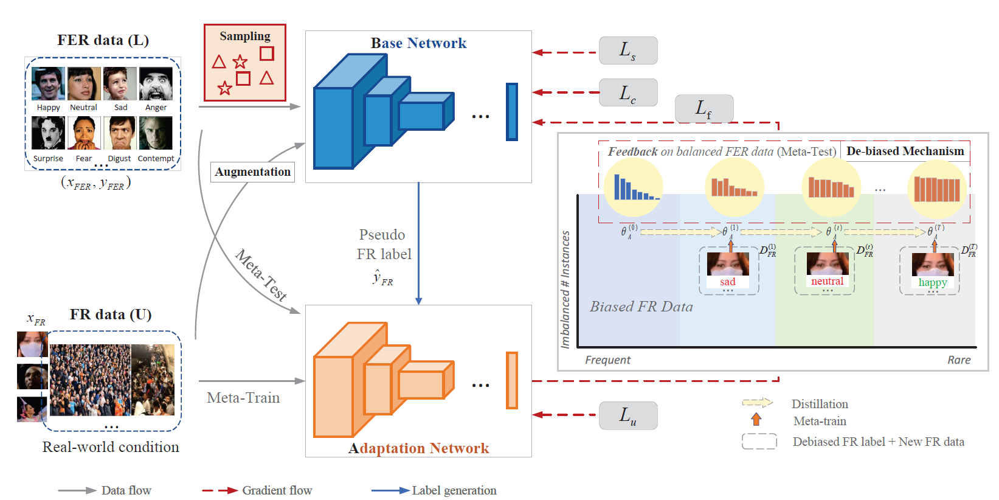

# Face2Exp
## Abstract
Facial expression recognition (FER) is challenging due to the potential class imbalance introduced by hard data collection and intractable labeling confusion.  We propose an the Meta-Face2Exp framework to explore large-scale unlabeled FR data to enhance FER.  Meta-Face2Exp consists of a basic-learner network and a meta-learner network. The basic-learner network with the feedback from the meta-learner network according to its cognitive differences between biased FR data and de-biased FER data. In the end, the meta-learner network according to its cognitive differences between biased FR data and de-biased FER data. In the end, the meta-learner network is equipped with the de-biased expression knowledge even without labeling. We demonstrate the de-biased behavior and effectiveness of our Meta-Face2Exp which is comparable to existing state-of-the-art with only 10% labeled FER data. Furthermore, our approach provides an cost-effective paradigm for real-world automatic expression recognition.
## Framework

## Command
The training command for affectnet is:
> python main.py --seed 5 --name aff --num-classes 7 --total-steps 180000 --eval-step 100 --randaug 2 16 --batch-size 8 --teacher_lr 1e-3 --student_lr 1e-3 --amp --resize 224 --world-size 2 --workers 16 

Our model is stored in the [Google drive](https://drive.google.com/file/d/116e1WILkG4RKjwol5OyczaROYsKja9CP/view?usp=sharing). 
For test program, just run the test.ipynb file after modifying the model path to test the accuracy and predict a single image.

